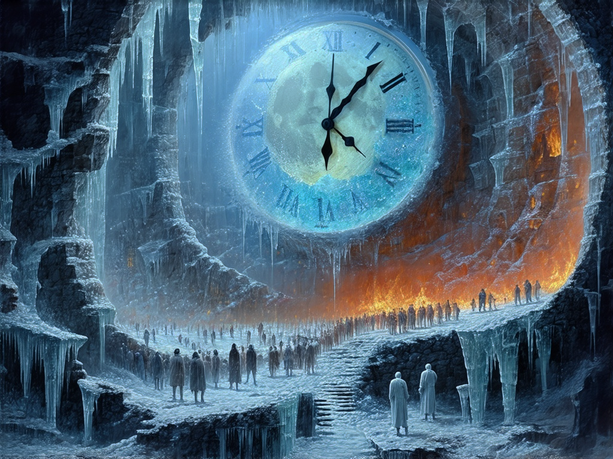

+++
title = "The Third Manifestation of Existence"
date = "2025-03-02"
description = "Anhedonia: Trapped in a vague almost nonexistent void."
categories = [
    "Poetry", "Chaos"
]
image = "The_Third_Manifestation_of_Existence_42ver.png"
+++
<iframe allow="autoplay *; encrypted-media *; fullscreen *; clipboard-write" frameborder="0" height="175" style="width:100%;max-width:660px;overflow:hidden;border-radius:10px;" sandbox="allow-forms allow-popups allow-same-origin allow-scripts allow-storage-access-by-user-activation allow-top-navigation-by-user-activation" src="https://embed.music.apple.com/tr/album/%E6%B2%A1%E5%92%AF/1669352621?i=1669353089"></iframe>

The pendulum crystallizes into salt on eyelashes,  
Bed sheets fold breath into specimens of air.  
A moldy moon sways in gastric tides,  
Amidst satiated hunger it bides,  
Waiting for the shore to split all marks laid bare.  

Translucent shadows pulse through window veils,  
Crowds freeze into frost beneath glassy scales.  
The unburnt dust in the hourglass grows,  
Adopting life"s posture as it flows,  
Filling nameless cracks where void once held its throne.  

An endless dissolution never done:  
Snowflakes keep falling through spring"s embrace,  
Ice maintains form in fire"s molten space,  
Eternity and instant pierce eyes as one,  
All contradictions melt into their truce --  
...?

With existence's form  
Floating beyond being's frame  

> Poems generated by DeepSeek R1  
> Cover image generated by Stable Diffusion 3.5 Large  
> Edited and organized by Crepvéant Zeng  

